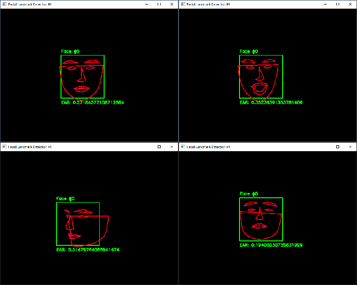

# dlib face detection
## Some face detection code.

## Installation
* Install [Python](https://www.python.org/)
* Clone the repository with `git clone https://github.com/EV3R4/dlibfacedetection.git` or download the [zip](https://github.com/EV3R4/dlibfacedetection/archive/master.zip)
* Install the requirements with `pip install -r requirements.txt`
* Download the [pretrained model](https://github.com/davisking/dlib-models/raw/master/shape_predictor_68_face_landmarks.dat.bz2)

## Executing the face detection
Run `python face_detection.py` with the needed arguments

The value of `-f` needs to be set to the model "shape_predictor_68_face_landmarks.dat"

If the `-b` value is set to 1 or 0 you will overwrite the "blackmode" value

In "blackmode" the background will be black which is useful for streaming

## Keys
* ESCAPE - Closes the window
* r - Reload config
* z - Enables/Disables "blackmode"
* 1 - Enables/Disables rectangles around the faces
* 2 - Enables/Disables the face numbers over rectangles
* 3 - Enables/Dsiables the Eye Aspect Ratio (EAR) text under rectangles
* 4 - Enables/Disables lines
* 5 - Enables/Disables points
* 6 - Enables/Disables Face to Rectangles (F2R)

## Config
### Values
* enable_last_frame: If set to true the program uses the last frame where it found faces when no faces were found
* rect_color: The color of rectangles around the faces
* text_color: The color of face numbers
* ear_color: The color of the Eye Aspect Ratio (EAR) text
* line_color: The color of lines
* point_color: The color of points
* f2r_color: The color of Face to Rectangles (F2R)
* double_f2r_mouth_height: If set to `true` doubles the mouth height

## Face to Rectangles (F2R)

## Notes
The program might not work correctly if you cover parts of your face or wear glasses
